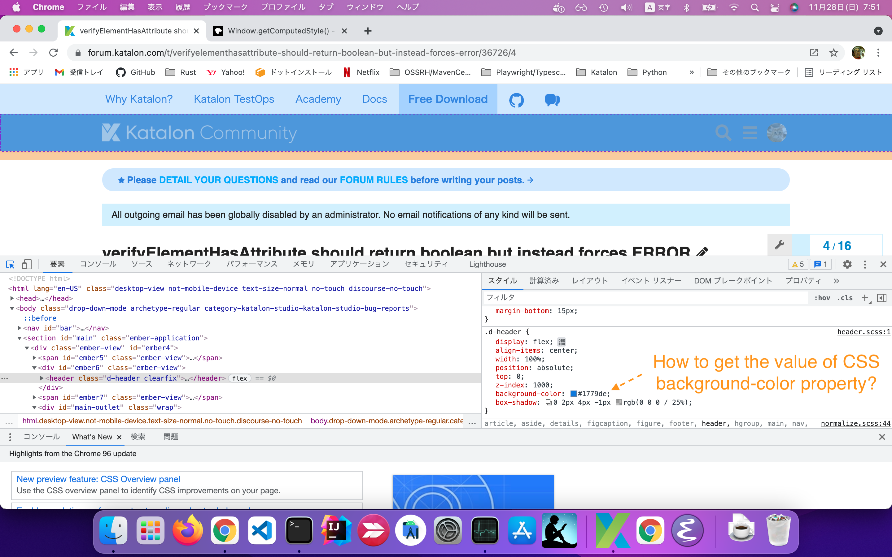

# How to verify value of CSS property in a web page

I made this project to propose a solution to a question raised in the Katalon Studio User Forum.

- https://forum.katalon.com/t/verifyelementhasattribute-should-return-boolean-but-instead-forces-error/36726/13

## Problem to solve

Here is an usual web page.

- [User forum page](https://forum.katalon.com/t/verifyelementhasattribute-should-return-boolean-but-instead-forces-error/36726/)

I want to write a Test Case script in Katalon Studio, that verifies if the background-color of the page header elemennt is `#1779de`.



Katalon Studio does not provide a built-in Keyword that solves my problem out of box. I need to develop a custom solution. But how?

## Solution

In JavaScript on browser, you can call *window.getComputedStyle(element)* :

- [Winndow.getComputedStyle(element)](https://developer.mozilla.org/en-US/docs/Web/API/Window/getComputedStyle)

>The Window.getComputedStyle() method returns an object containing the values of all CSS properties of an element, after applying active stylesheets and resolving any basic computation those values may contain.

>Individual CSS property values are accessed through APIs provided by the object, or by indexing with CSS property names.


## Description

### Test Case

- [TC1](Scripts/TC1/Script1638054110108.groovy)

```Scripts/TC1/Script1638054110108.groovy
```


This approach is version-independent. It should work with all versions of Katalo Studio since v7.x.

## Download the demo

You can download the zip of this project from the [Releases](https://github.com/kazurayam/ks_verify_CSS_property_computed/releases) page, download it, open it using your local Katalon Studio.
